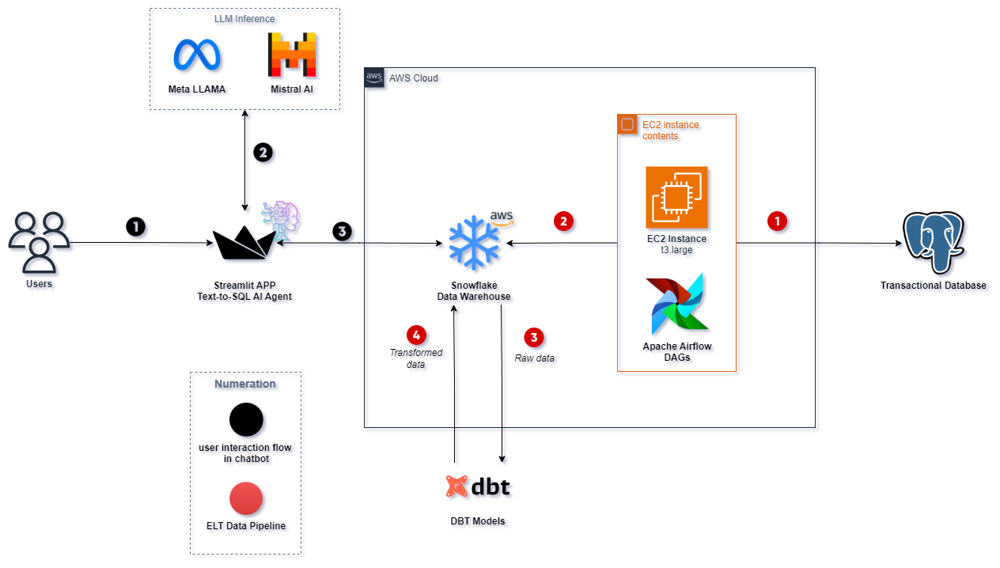

# Automotive Sales Data Pipeline & Natural Language SQL Agent

This project provides a comprehensive data pipeline solution for automotive sales analytics. It features incremental data loading from PostgreSQL to Snowflake using Apache Airflow, with DBT (Data Build Tool) transformations to generate analytical insights. Additionally, it includes an advanced multi-LLM (Large Language Model) SQL agent that allows for natural language querying of the data warehouse, making data access more intuitive and user-friendly.

## SQL Agent Demo

https://github.com/user-attachments/assets/98190828-7dfe-4ccf-8ad3-4d8c3ba28a0c


## Architecture Overview



The project consists of three main components:

1. **Data Ingestion (Airflow)**
   - Incremental loading from PostgreSQL
   - Daily scheduled execution
   - Optimized for performance and cost

2. **Data Transformation (DBT)**
   - Staging views for initial cleaning
   - Dimensional modeling
   - Fact tables for transactions
   - Analysis models for business insights

3. **Data Warehouse (Snowflake)**
   - Stores raw and transformed data
   - Supports analytical queries
   - Maintains data lineage

## Project Structure

```
pipeline-snowflake-airflow-dbt/
├── airflow-dag/                # Airflow DAG implementation
│   ├── dag-postgres-to-snowflake-incremental.py
│   └── README.md
├── dbt/                       # DBT transformations
│   ├── models/
│   │   ├── stage/            # Staging views
│   │   ├── dimensions/       # Dimension tables
│   │   ├── facts/           # Fact tables
│   │   └── analysis/        # Analysis models
│   ├── tests/               # Data quality tests
│   └── README.md
├── sql-agent/                  # Natural Language to SQL Agent
│   ├── src/                    # Agent source code
│   │   ├── agent.py           # Main agent logic
│   │   ├── workflow_nodes.py  # LangGraph workflow implementation
│   │   ├── prompts.py        # LLM prompts
│   │   ├── database_manager.py # Database connection handling
│   │   ├── llm_factory.py     # LLM initialization and management
│   │   ├── utils.py          # Utility functions
│   │   └── app.py            # Streamlit interface
│   ├── .env                  # Environment variables
│   ├── .gitignore           # Git ignore file
│   └── README.md             # Agent documentation
└── assets/                   # Documentation assets
    ├── dag_execution.png
    ├── data_lineage_dbt.png
    ├── sql_agent_demo.png    # SQL Agent interface demo
    └── mermaid_diagram.png   # Workflow visualization
```

## Data Flow

1. **Source (PostgreSQL)**
   - Automotive sales operational data
   - Seven core tables tracking business entities

2. **Ingestion (Airflow)**
   - Daily incremental loads
   - ID-based tracking
   - Optimized customer data loading

3. **Transformation (DBT)**
   - Standardized staging views
   - Dimensional modeling
   - Business logic implementation
   - Analytical aggregations

4. **Analysis (Snowflake Views)**
   - Sales performance metrics
   - Geographic analysis
   - Temporal trends
   - Product insights

5. **Natural Language SQL Agent**
   - Multi-LLM architecture
   - Automatic SQL generation
   - Query validation and correction
   - Human-readable answers

## Key Features

- **Incremental Processing**
  - ID-based incremental loads
  - Efficient resource utilization
  - Cost-optimized customer data handling

- **Data Quality**
  - Custom price validation tests
  - Relationship integrity checks
  - Business rule validation

- **Analysis Models**
  - Sales by geography
  - Salesperson performance
  - Vehicle popularity
  - Temporal analysis

- **Natural Language Queries**
  - Conversational interface to data
  - Multiple specialized LLMs
  - Automatic SQL generation and validation
  - User-friendly Streamlit interface

## Infrastructure

### AWS Deployment
- Airflow running on EC2 instance
- Docker-based deployment
- Installation script provided in `airflow-dag/install_airflow_ec2.sh`

## Documentation

- Detailed Airflow DAG documentation: [airflow-dag/README.md](airflow-dag/README.md)
- DBT transformation details: [dbt/README.md](dbt/README.md)

## Monitoring

- Airflow web interface for pipeline status
- DBT documentation for transformation lineage
- Snowflake query history for performance

## Analysis Tools

### SQL Agent
The project includes a sophisticated SQL agent that allows business users to query the data warehouse using natural language:

- **Multi-LLM Architecture**
  - Query Generation (Mistral Codestral)
  - Query Validation (Meta Llama 3.3)
  - Answer Generation (Meta Llama 3.1)

- **Intelligent Workflow**
  - Schema-aware query generation
  - Automatic query validation
  - Error recovery and query refinement
  - Natural language responses

- **User Interface**
  - Web-based Streamlit interface
  - SQL query transparency
  - Interactive results display
  - Error handling and feedback

The SQL Agent follows a structured workflow:
1. Query initialization
2. Schema loading and analysis
3. SQL query generation
4. Query validation and refinement
5. Query execution
6. Natural language response generation

For detailed information about the SQL Agent, see [sql-agent/README.md](sql-agent/README.md)

## Project Inspiration

This project builds upon foundational concepts presented in the [Bootcamp Engenharia de Dados: Construa um Projeto Real](https://www.udemy.com/course/bootcamp-engenharia-de-dados/?srsltid=AfmBOoqGkEALI2x4t2oTlA4dnnQs-JtJWpbIVp1yMGcy1IC5Vy_dcJYH) by Fernando Amaral on Udemy. While the course provided the initial framework for the data pipeline architecture, this project extends those concepts by incorporating additional features, such as a Multi-LLM SQL Agent for natural language querying.
