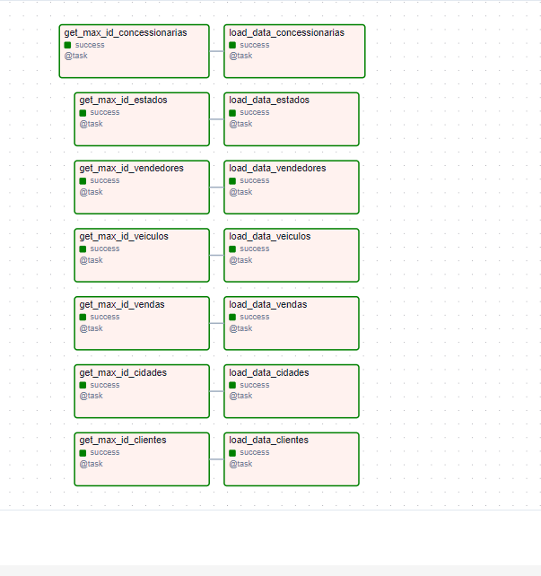

# Postgres to Snowflake Incremental DAG

This directory contains the Airflow DAG implementation for incremental data loading from PostgreSQL to Snowflake.

## DAG Structure


The diagram above shows the task dependencies for our ETL process. Each table has two associated tasks:

### Task Pairs
1. **get_max_id Tasks** (Left Column):
   - `get_max_id_concessionarias`
   - `get_max_id_estados`
   - `get_max_id_vendedores`
   - `get_max_id_veiculos`
   - `get_max_id_vendas`
   - `get_max_id_cidades`
   - `get_max_id_clientes`

2. **load_data Tasks** (Right Column):
   - `load_data_concessionarias`
   - `load_data_estados`
   - `load_data_vendedores`
   - `load_data_veiculos`
   - `load_data_vendas`
   - `load_data_cidades`
   - `load_data_clientes`

Each pair of tasks works together to ensure incremental loading:
- The `get_max_id` task determines the latest loaded record
- The `load_data` task transfers new records based on that ID

## Tables Covered

The DAG handles incremental data loading for the following tables:
- veiculos (Vehicles)
- estados (States)
- cidades (Cities)
- concessionarias (Dealerships)
- vendedores (Salespeople)
- clientes (Customers)
- vendas (Sales)

## Implementation Details

### Task Structure

For each table, the DAG creates two tasks:
1. **get_max_id_{table_name}**: Retrieves the maximum ID from Snowflake
2. **load_data_{table_name}**: Loads incremental data from Postgres to Snowflake

### Key Features

- Incremental loading based on ID tracking
- Dynamic column mapping
- Optimized customer data loading
- Error handling with retry mechanism

## Deployment & Infrastructure

### AWS EC2 Setup
- Deployed on AWS EC2 instance
- Docker-based installation
- Ubuntu-based environment

### Installation Steps
```bash
# Clone repository and run installation script
git clone <repository-url>
cd airflow-dag
chmod +x install_airflow_ec2.sh
./install_airflow_ec2.sh
```

## Configuration

### Required Connections
1. **postgres**
   - Type: Postgres
   - Used for source data extraction

2. **snowflake**
   - Type: Snowflake
   - Used for data loading

### Schedule
- Start Date: 2024-01-01
- Interval: Daily
- Catchup: Disabled

## Operations

### Error Handling
- No automatic retries configured
- Email notifications disabled
- Failure handling through Airflow's task instance management

### Task Status
- Green boxes indicate successful task execution
- Each task includes status indicators
- Tasks are linked to show dependencies
- All tasks marked with `@task` decorator

### Monitoring
- Airflow web interface
- Task logs
- Snowflake query history

### Success Criteria
- All tasks showing green status
- No task failures or retries
- Data consistency between source and target
- Expected record counts in Snowflake

## Development Guidelines

When developing or modifying the DAG:
1. Test changes in a development environment
2. Verify task dependencies
3. Confirm proper error handling
4. Validate data consistency