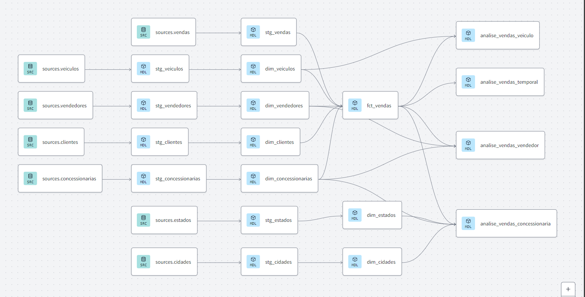

# DBT Models for Automotive Sales Analytics

This directory contains DBT transformations for analyzing automotive sales data from our Snowflake warehouse.

## Data Lineage


The diagram above illustrates the data flow through our transformation layers:

1. **Sources Layer** (`sources_*`):
   - Raw data tables including vehicles, sales, customers, salespeople, and dealerships
   - Entry point for all data transformations

2. **Staging Layer** (`stg_*`):
   - Initial transformation of raw data
   - Basic cleaning and standardization
   - One-to-one mapping with source tables

3. **Dimension Layer** (`dim_*`):
   - Enriched business entities
   - Contains vehicles, customers, salespeople, and dealerships dimensions
   - Serves as reference tables for fact table

4. **Fact & Analysis Layer**:
   - Central fact table (`fct_vendas`) connecting all dimensions
   - Analysis models for specific business views:
     - Vehicle sales analysis (`analise_vendas_veiculo`)
     - Temporal sales analysis (`analise_vendas_temporal`)
     - Salesperson performance (`analise_vendas_vendedor`)
     - Dealership analysis (`analise_vendas_concessionaria`)

## Project Structure

```
dbt/
├── models/
│   ├── stage/              # Staging layer
│   │   ├── stg_vendedores.sql
│   │   ├── stg_vendas.sql
│   │   ├── stg_veiculos.sql
│   │   ├── stg_estados.sql
│   │   ├── stg_concessionarias.sql
│   │   ├── stg_clientes.sql
│   │   └── stg_cidades.sql
│   ├── dimensions/         # Dimensional models
│   │   ├── dim_vendedores.sql
│   │   ├── dim_veiculos.sql
│   │   ├── dim_estados.sql
│   │   ├── dim_concessionarias.sql
│   │   ├── dim_clientes.sql
│   │   └── dim_cidades.sql
│   ├── facts/             # Fact tables
│   │   └── fct_vendas.sql
│   └── analysis/          # Analytical models
│       ├── analise_vendas_vendedor.sql
│       ├── analise_vendas_veiculo.sql
│       ├── analise_vendas_temporal.sql
│       └── analise_vendas_concessionaria.sql
├── tests/
│   └── test.sql         # Custom data quality tests
```

## Models Overview

### Staging Layer (Views)
Clean and standardize raw data:
- Data type conversions (DECIMAL for monetary values)
- Text standardization (INITCAP, TRIM, UPPER)
- Default value handling (COALESCE)
- Column renaming for clarity

### Dimension Models (Tables)
Core business entities:
- **dim_vendedores**: Salespeople information
- **dim_veiculos**: Vehicle catalog
- **dim_estados**: Geographic regions
- **dim_concessionarias**: Dealership details
- **dim_clientes**: Customer information
- **dim_cidades**: Cities with state relationships

### Fact Model (Incremental Table)
- **fct_vendas**: Sales transactions with dimensional relationships
  - Incremental loading based on venda_id
  - References all dimension tables
  - Maintains data integrity through joins

### Analysis Models (Tables)
Business insights:
- Sales by salesperson and dealership
- Vehicle performance metrics
- Temporal sales analysis
- Regional performance breakdown

## Materialization Strategy

- Staging: Views (lightweight, always fresh)
- Dimensions: Tables (stable, lookup focused)
- Facts: Incremental tables (efficient updates)
- Analysis: Tables (pre-computed metrics)

## Running the Models

```bash
# Full refresh
dbt run --full-refresh

# Layer specific runs
dbt run --models stage
dbt run --models dimensions
dbt run --models facts
dbt run --models analysis

# Specific model
dbt run --models fct_vendas
```

## Testing Strategy

### Custom Data Tests

1. **Sales Price Validation Test** (`tests/test.sql`)
   - Validates if sale prices are within acceptable range
   - Checks if sale price is between 95-100% of suggested price
   - Identifies potentially problematic transactions
   - SQL test returns failed records for investigation

### Test Implementation

```sql
-- Example of price validation test results
SELECT 
    venda_id,
    valor_venda,
    valor_sugerido,
    (valor_venda / valor_sugerido * 100)::DECIMAL(5,2) as desconto_percentual
FROM vendas_comparacao_preco
WHERE regra_respeitada = FALSE
```

### Running Tests

```bash
# Run all tests
dbt test

# Run specific test
dbt test --models test_vendas_preco

# Test with custom output
dbt test --store-failures
```

### Test Monitoring

- Failed tests are logged in Snowflake
- Test results available in dbt documentation
- Custom alerting can be configured for test failures

### Test Categories

1. **Data Quality Tests**
   - Price validation
   - Reference integrity
   - Null checks

2. **Business Rule Tests**
   - Price range compliance
   - Date consistency
   - Relationship validation


## Dependencies

1. Source Tables (Snowflake):
   - vendedores
   - vendas
   - veiculos
   - estados
   - concessionarias
   - clientes
   - cidades

2. Configuration:
   - Snowflake connection
   - Source definitions
   - Model configurations