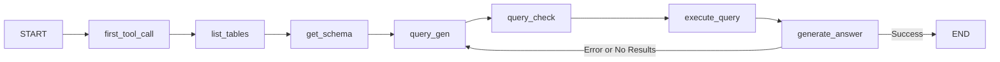

# Multi-LLM SQL Agent

A sophisticated SQL agent that leverages multiple specialized LLMs in a directed workflow to generate, validate, and execute SQL queries against a Snowflake database.

## Architecture

### LLM Specialization

The agent uses different LLMs optimized for specific tasks:

- **Query Generation** (Mistral Codestral): Specialized in SQL generation
- **Query Validation** (Meta Llama 3.3): Reviews and fixes SQL queries
- **Answer Generation** (Meta Llama 3.1): Crafts human-readable responses

### Workflow Graph

The agent uses LangGraph to implement a directed workflow:



### State Management

The workflow maintains a state object containing:
```python
class State(TypedDict):
    messages: list[AnyMessage]  # Conversation history
    sql_query: str | None       # Current SQL query
    execution_result: str | None # Query results
    error: str | None          # Error messages
```

## Workflow Steps

1. **Discovery Phase**
   - Lists available tables
   - Retrieves schema information
   - Builds context for query generation

2. **Query Generation** (Mistral Codestral)
   - Takes user question and schema context
   - Generates initial SQL query
   - Formats query following best practices

3. **Query Validation** (Llama 3.3)
   - Checks for common SQL mistakes
   - Validates Snowflake compatibility
   - Rewrites query if needed

4. **Query Execution**
   - Executes validated query
   - Captures results or errors
   - Returns formatted table output

5. **Answer Generation** (Llama 3.1)
   - Takes query results
   - Generates human-readable answer
   - Returns to query gen if needed

## Error Handling

- Any error in the workflow triggers a return to query generation
- Each LLM has specific error handling for its task
- Rate limiting and retries are built into LLM calls

## Usage

```python
from agent import create_workflow

# Create the agent
agent = create_workflow()

# Ask a question
state = agent.invoke({
    "messages": [("user", "What are the top 5 selling dealerships?")]
})

# Get results
sql_query = state.get("sql_query")
results = state.get("execution_result")
answer = state["messages"][-1].content
```

## Installation

1. Clone the repository
2. Install dependencies:
```bash
pip install -r requirements.txt
```

3. Set up environment variables:
```bash
MISTRAL_API_KEY=your_key
GROQ_API_KEY=your_key
SNOWFLAKE_* credentials
```

## Web Interface

A Streamlit interface is provided for easy interaction:

```bash
streamlit run src/app.py
```

## Key Features

- Multi-LLM architecture for specialized tasks
- Directed workflow with error recovery
- Snowflake-specific SQL validation
- State management throughout the workflow
- Extensive logging and error handling
- Rate limiting for API calls
- Clean separation of concerns

